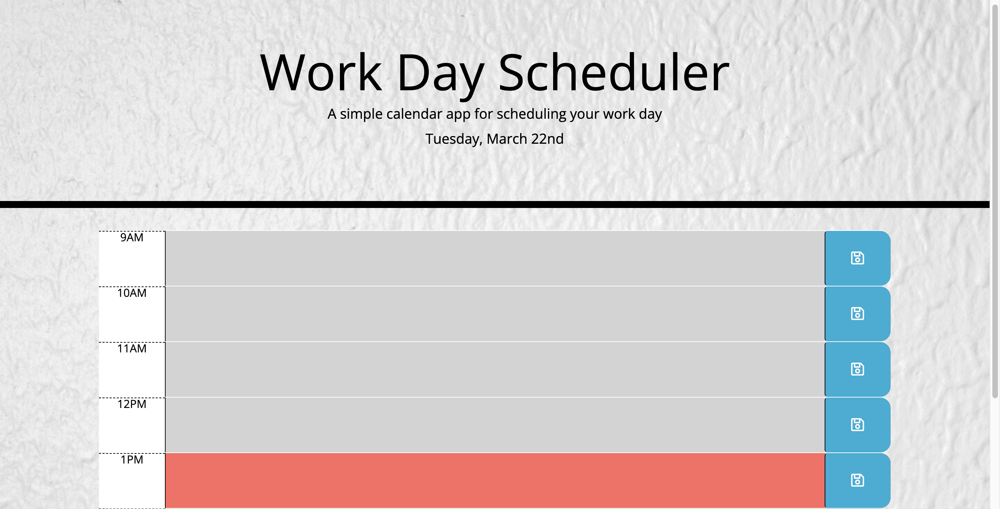
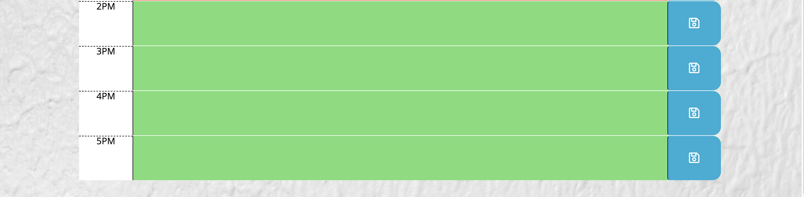

# Day-Planner

## Description
Simple Day planner during office hour can help employee with a busy schedule. So they can manage their time effectively, especially if they have important events. Mostly we use JQuery to create it with MomentJS. JQuery is a JavaScript library design to simplify HTML DOM tree traversal and manipulation, as well as event handling, CSS animation, and Ajax.  MomentJS is a JavaSript library which helps is parsing, validating, manipulating and displaying date/time in JavaSript. To make look better I make padding buttom 30px and a background image in CSS.

## Demo

## Live Link
https://b-smd.github.io/Day-Planner/

https://github.com/B-smd/Day-Planner.git

## Technologies Used
- HTML
- CSS
- JavaScript
- JQuery
- MomentJS

## Usage
You can create a schedule with this Day-Planner.
When you open the planner, then the current day is displayed at the top of the calender. When you scroll down it is presented with timeblocks for standard business hours. There is 8 timeblok, each timeblock is color coded to indicate for grey color is in the past, red color is present and green color is the future.
When you clik into a timeblock, then you can enter an event. When you click the save button for that time block, then the text for that event is saved in local storage. When you clear the text and you refresh the page, events persist.

## Contributing
Pull request are welcome, you can make a constribution at the bottom of any docs page to make small changes such as a typo, sentence fix or a broken link. For major changes, please open an issue first to discuss what you would like to change.

## Licence
[MIT]
(https)://chooseaLicence.com/Licences/mit/)
